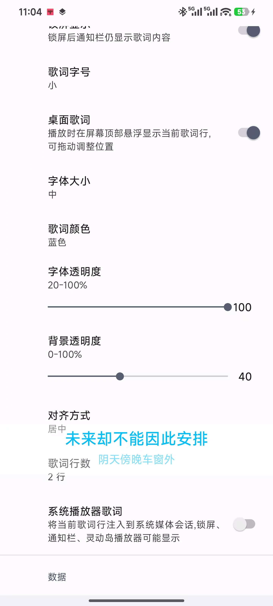
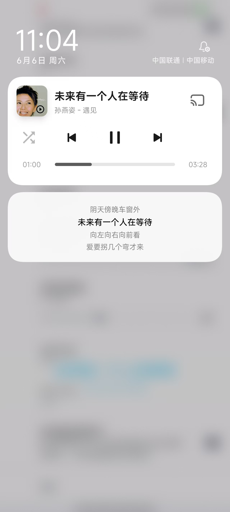
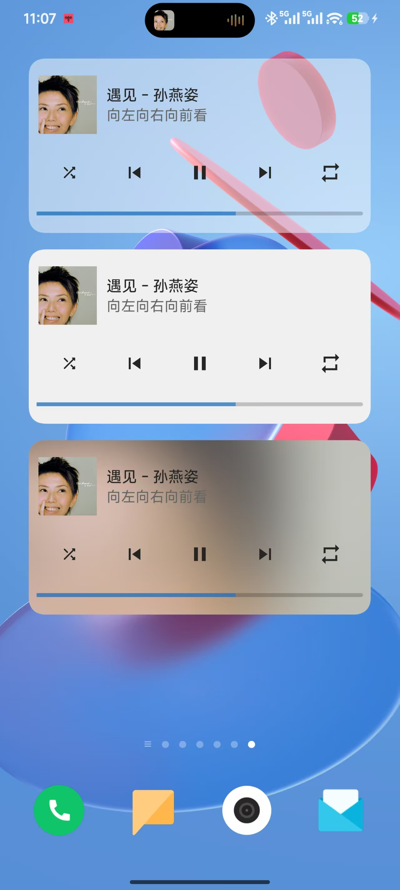
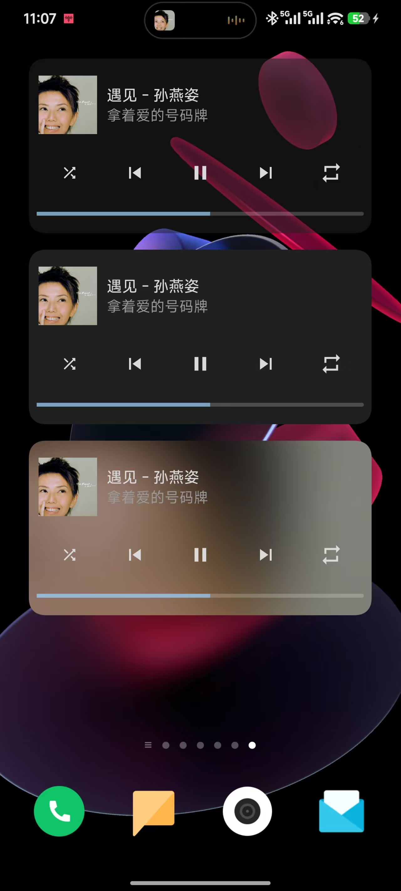
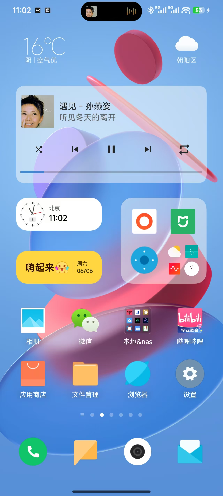
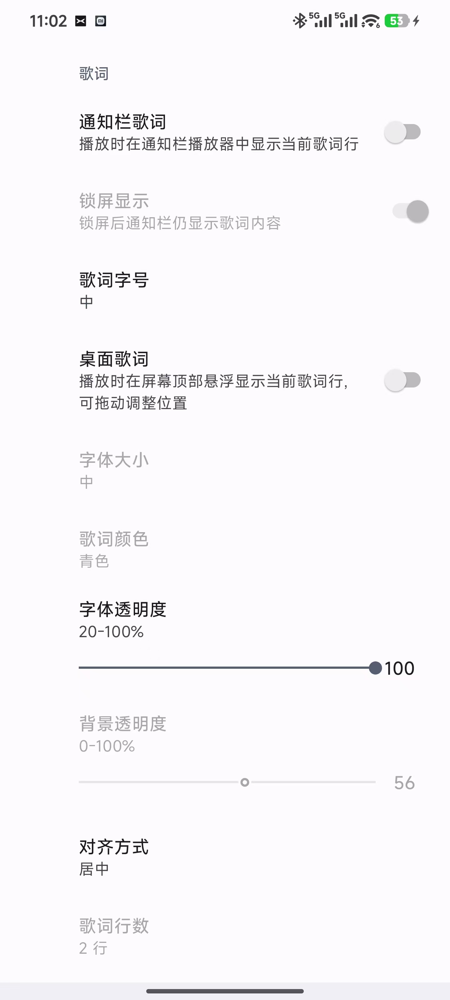

<p align="center">
  
</p>

## 

> nas音乐重度用户，navidrome重度使用者，一直在用tempo，但是对于歌词显示功能缺失一直很遗憾。直到aicoding出现。
> 完全0编程基础，全程opencode自然语言对话，成功增加了多个歌词显示功能。
> 之前，我从未想过自己还有机会自己编程，然后还能上传，以至于修改过程中的前几个版本都覆盖掉了。
> 是的，时代变了。
>
> 感慨完了，以下内容均为ai生成了，其实，我也不知道他描述的功能对不对。

# Tempo Mod 3.9.0.6

> ⚠️ **本项目是基于 [CappielloAntonio/tempo](https://github.com/CappielloAntonio/tempo) 3.9.0 的修改版本（Mod）**
>
> 原项目以 [GPL-3.0](LICENSE) 协议开源，本 Mod 同样以 GPL-3.0 协议发布。
> 详细新增功能、修改说明见下方。

---

## 简介

原版 Tempo 是一款开源的 Subsonic 音乐客户端（[原项目地址](https://github.com/CappielloAntonio/tempo)）。

本 Mod 在原版基础上**新增了歌词相关功能**（桌面歌词、通知栏歌词、系统播放器歌词），并首次引入 **3 个 Android 桌面小部件**（透明播放器 / 纯色播放器 / 专辑色播放器）。

---

## ✨ 新增功能

### 1. 桌面歌词悬浮窗

- **位置**：设置 → 歌词 → 桌面歌词
- **行为**：开启后请求"显示在其它应用上层"权限，授予后会在屏幕上叠加一个可拖动的歌词窗
- **特性**：
  - 跟随播放进度高亮当前行
  - 可拖动到任意位置
  - 屏幕旋转时位置自动重新计算
  - 退出应用/暂停播放时自动隐藏
  - 歌词行数 1-4 行可选
  - 对齐方式（左/中/右）
  - 字体透明度 20-100%
  - 背景自适应系统主题

<p align="center">
  
</p>

### 2. 通知栏歌词

- **位置**：设置 → 歌词 → 通知栏歌词
- **行为**：在系统的媒体通知卡片下方追加通知栏，显示歌词
- **特性**：
  - 字号 3 档（小 13/15sp 4 行、中 16/18sp 3 行、大 20/22sp 2 行）
  - 锁屏显示开关（默认开）
  - 点击通知栏任意一行打开主 App
  - 暗色模式自动适配（`layout-night/`）

<p align="center">
  
</p>

### 3. 系统播放器歌词（灵动岛/锁屏）

- **位置**：设置 → 歌词 → 系统播放器歌词
- **行为**：通过 Android `MediaSession` 的 `title` 字段周期注入当前歌词行
- **支持的设备**：
  - ✅ 小米 HyperOS（锁屏播放卡片 + 灵动岛）
  - ✅ 三星 One UI（锁屏 + 通知卡片标题）
  - ✅ 其它标准 MediaSession 消费者
- **特性**：
  - 开启时：`title` = 当前歌词行，`artist` = "原 artist - 原 title"
  - 关闭时：从 `extras["original_title"]` / `extras["original_artist"]` 恢复原值
  - 拦截 `onMediaItemTransition(PLAYLIST_CHANGED)`，避免歌词模块被反复触发

### 4. Android 桌面小部件（3 个变体）

长按桌面 → 部件 → 选 Tempo 提供的 3 个小部件之一 → 拖到桌面。4x2 尺寸，可自由缩放，每秒自动刷新。

| 名称 | 背景 | 圆角 |
|------|------|------|
| **透明播放器** | 50% 半透明，跟随主题色 | 16dp |
| **纯色播放器** | 纯色 `#F0F0F0` / `#202020` | 16dp |
| **专辑色播放器** | 专辑图高斯模糊 + 25% 主题色蒙版 | 16dp |

统一布局：
- 顶部：60dp 专辑封面 + 标题/艺术家/歌词（2 行）
- 中部：5 个控件（shuffle / 上一首 / 播放暂停 / 下一首 / 重复）
- 底部：4dp 进度条（带圆头 thumb） + 5 段点击 seek（10% / 30% / 50% / 70% / 90%）
- 点击非按钮区域打开主 App
- 颜色跟随系统深色/浅色模式
- 专辑封面用 Glide 异步加载，切歌时自动重载

<p align="center">
  
  
  
</p>

### 5. 设置项重构

- **"歌词"独立成组**：从原"界面"分类抽出，新建立"歌词"分类
- **主从开关联动**：关闭主开关时子选项自动 disable

<p align="center">
  
</p>

---

## 🔧 技术细节

<table>
<colgroup>
<col width="30%">
<col width="35%">
<col width="35%">
</colgroup>
<thead>
<tr><th align="left">改动</th><th align="left">文件</th><th align="left">说明</th></tr>
</thead>
<tbody>
<tr><td>桌面歌词核心</td><td><code>DesktopLyricsOverlay.kt</code></td><td>悬浮窗 + 行数/对齐/透明度</td></tr>
<tr><td>桌面歌词布局</td><td><code>desktop_lyrics_overlay.xml</code></td><td>4 行歌词</td></tr>
<tr><td>通知栏歌词</td><td><code>NotificationHelper.kt</code></td><td>字号 3 档 + 锁屏可见性</td></tr>
<tr><td>通知栏布局</td><td><code>notification_small.xml</code>（+ night）</td><td>浅色/深色主题</td></tr>
<tr><td>系统播放器歌词</td><td><code>MediaService.kt</code></td><td>注入歌词到 MediaSession</td></tr>
<tr><td>小部件</td><td><code>widget/*Provider.kt</code></td><td>3 个 AppWidgetProvider + 刷新 + 点击</td></tr>
<tr><td>小部件布局</td><td><code>widget_lyrics*.xml</code></td><td>3 个变体布局</td></tr>
<tr><td>设置项</td><td><code>global_preferences.xml</code></td><td>"歌词"分类</td></tr>
<tr><td>中文化</td><td><code>strings.xml</code></td><td>翻译歌词相关设置说明</td></tr>
</tbody>
</table>

### 实现原理（系统播放器歌词）

```kotlin
// 周期执行（约 1 秒）
val currentLyricLine = lyrics[currentPosition]
player.replaceMediaItem(
    currentMediaItem.mediaId,
    currentMediaItem.buildUpon()
        .setMediaMetadata(
            MediaMetadata.Builder()
                .setTitle(currentLyricLine)        // 注入歌词行
                .setArtist("${originalArtist} - ${originalTitle}")  // 备份原信息
                .setExtras(Extras().apply {
                    putString("original_title", originalTitle)      // 用于恢复
                    putString("original_artist", originalArtist)
                })
                .build()
        )
        .build()
)
```

小米 HyperOS 的 `Cir_Miplay_MetaInfoManager`（MiPlay SDK）会自动监听所有活跃 `MediaSession`，把 `title` 字段映射为灵动岛显示文本——这就是为什么"改 title"就能让系统播放器显示歌词。

---

## 📦 安装

### 下载

前往 [Releases](https://github.com/yangjian1412/tempo-gai/releases) 页面下载 `tempo-mod-3.9.0.6-release.apk`。

### 系统要求

- Android 5.0+（与原版一致）
- 桌面歌词需要：Android 6.0+（悬浮窗权限从 6.0 开始需要用户授权）
- 系统播放器歌词需要：设备有 MediaSession 消费者（小米/三星/标准 Android 锁屏均可）
- 桌面小部件需要：标准 Android launcher（小米/三星/原生均可）

### 安装步骤

1. 下载 `tempo-mod-3.9.0.6-release.apk`
2. 手机上开启"未知来源应用"权限
3. 点击 APK 安装
4. 首次启动会提示授予存储/通知权限
5. **桌面歌词**功能需要在设置里单独开启并授予"显示在其它应用上层"权限
6. **桌面小部件**长按桌面 → 部件 → 选 Tempo 提供的 3 个小部件之一
7. 完整体验歌词功能需要配置 Subsonic 服务器并启用"歌词显示"

---

## 📜 协议

本项目以 **GNU General Public License v3.0** 协议发布，与上游 [CappielloAntonio/tempo](https://github.com/CappielloAntonio/tempo) 一致。

详见 [LICENSE](LICENSE) 文件。

---

## 🙏 致谢

- **原作者**：[Antonio Cappiello](https://github.com/CappielloAntonio) — 创建并维护了 Tempo 这个优秀的 Subsonic 客户端
- **参考实现**：[椒盐音乐（Salt Player）](https://github.com/Moriafly/SaltPlayerSource) 的 `MediaPlayerWrapper.onMetadataChanged` 给我提供了"通过 title 注入歌词到系统 MediaSession"的思路
- **MiPlay SDK**：小米 HyperOS 灵动岛/锁屏歌词显示依赖 `Cir_Miplay_MetaInfoManager` 服务
- **Minimax & opencode**：改版过程中所有代码均由opencode+minimax生成封装

---

## 💬 反馈

- 提 Issue：https://github.com/yangjian1412/tempo-gai/issues
- 原始 Tempo 项目 Issue：https://github.com/CappielloAntonio/tempo/issues

**注意**：原版 Tempo 的 Bug 请到原作者仓库反馈；本 Mod 特有的问题（桌面歌词、通知栏歌词、系统播放器歌词、小部件相关）请到本仓库反馈。

---

## 📊 版本历史

| 版本 | 日期 | 说明 |
|---|---|---|
| 3.9.0.6 | 2026-07-24 | 修复 R8 混淆闪退 + 歌词时间戳被覆盖 + PlayerLyricsFragment 泄漏 |
| 3.9.0.5 | 2026-06-06 | 桌面歌词/通知栏歌词强化 + 3 个 Android 桌面小部件 |
| 3.9.0.4 | 2026-05-30 | 系统播放器歌词（MediaSession 注入） + 桌面歌词闪退 Bug 修复 |
